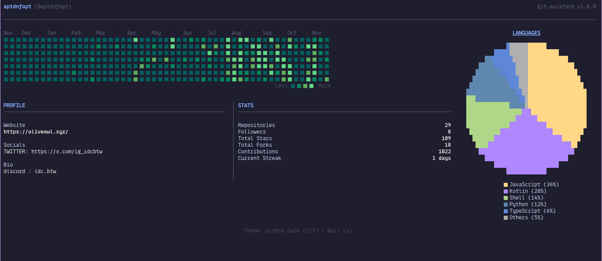
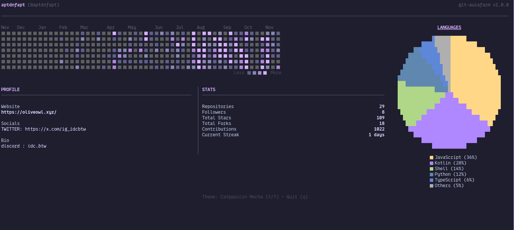

# git-aurafarm

A beautiful terminal interface for your GitHub statistics.

## Screenshots

### Default Theme


### Catppuccin Theme


## Features

- **Responsive Design**: The contribution calendar automatically scales to fit your terminal window.
- **Interactive**: Stays open as a dashboard (press `q` to quit).
- **Git Stats**: Fetches repositories, followers, and contribution graph.
- **Zero Config**: Uses your existing `gh` CLI authentication.

## Prerequisites

- Node.js (v14+)
- **Authentication** (choose one):
  - GitHub CLI (`gh`) installed and authenticated (`gh auth login`)
  - OR set `GITHUB_TOKEN` environment variable

## Usage

### Global Install
```bash
npm install -g git-aurafarm
git-aurafarm
```

### NPX (no install required)
```bash
npx git-aurafarm
```

### Run Locally

1. Clone the repo:
   ```bash
   git clone https://github.com/aptdnfapt/git-aurafarm
   cd git-aurafarm
   ```
2. Install dependencies:
   ```bash
   npm install
   ```
3. Build:
   ```bash
   npm run build
   ```
4. Run:
   ```bash
   npm start
   # OR
   node dist/cli.js
   ```

### Options

- `--mock`: Use mock data (useful for testing UI without API limits or auth).

```bash
npm start -- --mock
```

## Development

This project uses:
- [Ink](https://github.com/vadimdemedes/ink) for the React-based TUI.
- [Execa](https://github.com/sindresorhus/execa) to call `gh` CLI.

To build for production/npx:
```bash
npm run build
```

---

> **Name origin:** Was watching too many Minecraft videos and couldn't come up with a good name 💀 [Reference](https://youtu.be/3V7Rvo4Gvic?si=Vd_OtfFLSy05yXmb)
